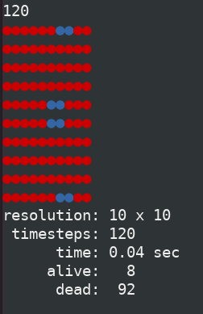
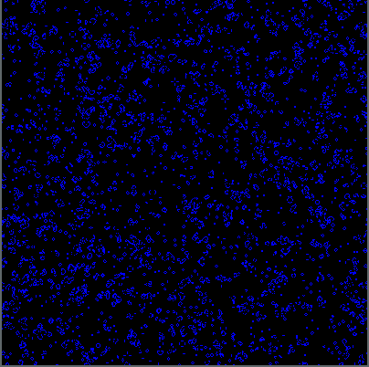

# pycgol
python fun with game of life program

things to learn:
- numpy
- graphics (pygame?)
- command-line options (click?)
- parallel processing?
- profiling


## running

```
# run 10x10 grid for 120 timesteps, display progress to terminal
./app.py --res 10 --nts 120 --term
```




```
# run 200x200 grid for 420 timesteps, display progress using pygame
./app.py --res 200 --nts 420 --pyg
```




## depends on

```
$ dpkg -l | grep pygame
ii  python3-pygame        1.9.6+dfsg-2build1

$ dpkg -l | grep python3-click
ii  python3-click         7.0-3
```


## unit testing

```
$ python3 test_utils.py
..
----------------------------------------------------------------------
Ran 2 tests in 0.000s

OK
```

## profiling

```
$ python3 -m cProfile -o output ./pycgol.py  --res 500 --nts 200
$ python3
Python 3.8.10 (default, Sep 28 2021, 16:10:42)
>>> import pstats
>>> from pstats import SortKey
>>> p = pstats.Stats('output')
>>> p.sort_stats(SortKey.CUMULATIVE).print_stats(10)
Mon Nov 29 12:12:40 2021    output

         51945224 function calls (51938635 primitive calls) in 111.858 seconds

   Ordered by: cumulative time
   List reduced from 2129 to 10 due to restriction <10>

   ncalls  tottime  percall  cumtime  percall filename:lineno(function)
    590/1    0.002    0.000  111.860  111.860 {built-in method builtins.exec}
        1    0.000    0.000  111.860  111.860 ./pycgol.py:3(<module>)
        1    0.000    0.000  111.664  111.664 /usr/lib/python3/dist-packages/click/core.py:762(__call__)
        1    0.000    0.000  111.664  111.664 /usr/lib/python3/dist-packages/click/core.py:658(main)
        1    0.000    0.000  111.663  111.663 /usr/lib/python3/dist-packages/click/core.py:950(invoke)
        1    0.001    0.001  111.663  111.663 /usr/lib/python3/dist-packages/click/core.py:518(invoke)
        1    0.036    0.036  111.662  111.662 ./pycgol.py:39(main)
      201   32.909    0.164  110.437    0.549 ./pycgol.py:82(update)
 50250000   77.502    0.000   77.502    0.000 /scratch/knerr/repos/pycgol/./utils.py:12(count)
      201    0.394    0.002    0.394    0.002 {built-in method pygame.display.flip}
```
